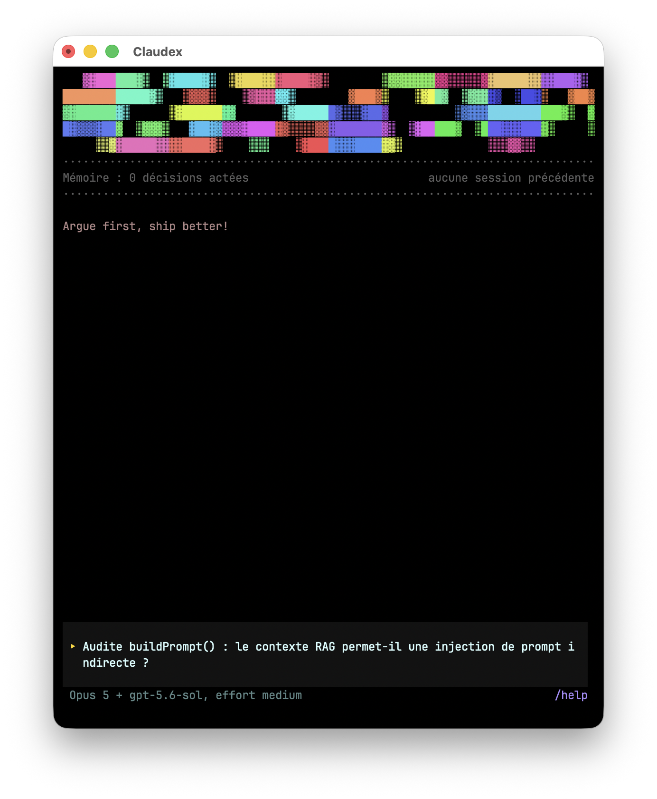

# Claudex

Claudex runs a structured debate between Claude Code and Codex on a technical question, inside a single terminal, with a human arbitrating. It replaces the manual copy-paste of one tool's answer into the other.



## How it works

*The application's own interface and messages are in French.*

A session always follows the same cycle:

1. A technical question is asked.
2. Claude answers. The answer is forwarded to Codex.
3. Codex answers. The answer is forwarded to Claude.
4. The cycle repeats until both agents explicitly agree.
5. Claudex prints a summary of what was decided.
6. `/handoff` writes that decision to a standalone markdown file, ready to hand to a `claude` or `codex` session for implementation.

Throughout the debate, both agents are read-only. They read the code, they do not modify it.

The topic is not restricted to architecture. Anything settled before code gets written fits: choosing between two approaches, reviewing existing code, diagnosing an observed bug, weighing a trade-off.

## Notable points

**Verbatim forwarding.** No answer is summarised before reaching the other agent. The text is passed on in full.

**No turn limit.** The debate runs until consensus is reached. `Esc` pauses it at any moment, including while an agent is writing.

**Human intervention at any point.** A message can be addressed to both agents, or to a single one.

**Topic qualification.** The first message is assessed before it becomes the official topic. An off-topic or incomplete request receives an answer and waits for clarification. Nothing is written to project memory until a topic has been accepted.

**Persistent project memory.** Decisions and constraints are stored in `.claudex/memory/`, then read again automatically at the start of every session by Claude through `CLAUDE.md` and by Codex through `AGENTS.md`.

**Plain terminal output.** The debate is written like ordinary output. Scrolling, selection and copy-paste remain those of the terminal, and nothing already displayed is ever redrawn.

## What leaves the machine

Worth reading before pointing Claudex at a repository owned by someone else, or using it in a professional setting.

**The code is sent to two providers.** Claudex drives Claude Code (Anthropic) and Codex (OpenAI). Everything the agents read, whether files, excerpts or search results, is sent to both, and each answer from one is forwarded to the other.

**Codex runs commands, Claude Code does not.** During a debate, Codex can execute shell commands inside an operating system sandbox that prevents it from writing to the repository or reaching the network. Claude Code has no execution tool at all during a debate: it is restricted to reading and searching files.

**Read-only means "cannot modify anything", not "only sees the repository".** In the current version of Codex, nothing restricts what a command may read. It can open any file the current account has access to and copy its contents into the transcript, which is then sent to both models and written to disk. Without network access a command cannot exfiltrate anything by itself, but it can still copy. Claudex should therefore not be used to analyse untrusted code.

**Debates are written inside the repository.** Claudex creates a `.claudex/` directory at the root of the folder it is launched from, and stores transcripts there. On first launch it also installs a `.gitignore` so those transcripts never reach a commit. Decisions and limits stay committable on purpose: they are short, and both `CLAUDE.md` and `AGENTS.md` point to them.

## Requirements

| Required | Purpose |
|---|---|
| Node.js 22 or newer | Runs Claudex |
| A Claude subscription (Pro, Max or Team) | Powers the Claude Code agent |
| A ChatGPT subscription (Plus, Pro or Business) | Powers the Codex agent |
| An interactive terminal | Claudex refuses to start inside a script or a pipe |

Both subscriptions are required at the same time, because a debate consumes tokens on both sides simultaneously. With only one of them, Claudex starts but the debate fails on the first turn.

### No API key is needed

Claudex asks for no API key, stores none and reads none. There is no `.env` file to create and no environment variable to set.

Authentication happens once, inside Claude Code and inside Codex, using the usual accounts. Claudex then reuses those sessions. The only thing it reads from the configuration is the default model, so that it can display it on the dashboard.

One exception is worth knowing about. If the `ANTHROPIC_API_KEY` environment variable is set, Claude Code may use it instead of the subscription, which means per-token billing. To stay on the subscription, `echo $ANTHROPIC_API_KEY` should print nothing.

## Installation

### 1. Node.js

```bash
node --version
```

If the reported version is below `v22`, install Node.js from [nodejs.org](https://nodejs.org), choosing the LTS release, then open a new terminal.

### 2. Claude Code

```bash
npm install -g @anthropic-ai/claude-code
claude
```

Sign in on first launch, then quit with `/quit`. Confirm with `claude --version`.

### 3. Codex

```bash
npm install -g @openai/codex
codex
```

Sign in on first launch, then quit. Confirm with `codex --version`.

### 4. Claudex

```bash
git clone https://github.com/hooop/claudex.git
cd claudex
npm install
npm link
```

`npm link` makes the `claudex` command available from any directory. It creates a link to this folder, which must therefore not be moved afterwards. To remove the command later: `npm unlink -g claudex`.

### 5. Verification

```bash
npm run check
```

This runs the strict TypeScript typecheck, ESLint, then 283 tests. Everything should pass.

### Common problems

| Message | Cause and fix |
|---|---|
| `command not found: claudex` | Step 4 did not complete. Run `npm link` again from the `claudex` folder. |
| `Claudex a besoin d'un vrai terminal interactif (TTY)` | Claudex was started inside a script or a pipe. Start it directly in a terminal. |
| `command not found: claude` or `codex` | Repeat step 2 or step 3. |
| The debate fails on the first turn | One of the two accounts is not signed in. Run `claude` and `codex` separately to check. |
| `EACCES` during `npm install -g` | Insufficient permissions on the global npm directory. See [the npm documentation](https://docs.npmjs.com/resolving-eacces-permissions-errors-when-installing-packages-globally). |

## Usage

```bash
claudex
```

The welcome screen shows the configured models and the state of the project memory, then waits for a topic.

To start straight on a topic:

```bash
claudex "What architecture should the video timeline use?"
```

### Walkthrough of a session

1. Move into the directory of the project concerned. Claudex reads that directory and writes its memory there.
2. Run `claudex`.
3. Type the question, in plain language.
4. Let the debate run. `Esc` pauses it, and a plain message redirects both agents.
5. Once consensus is reached, the summary appears automatically.
6. `/handoff` writes the decision to a standalone markdown file.
7. `/quit` archives the session and exits.

No code is modified anywhere along this path. A session produces a decision and a markdown file.

### Commands

Talking to the agents:

| Command | Effect |
|---|---|
| plain text | Message sent to both agents. On the welcome screen, starts the debate on that topic. |
| `/claude <text>` | Message addressed to Claude only |
| `/codex <text>` | Message addressed to Codex only |
| `/model claude\|codex <name>` | Changes an agent's model, including before the debate starts |

Recording:

| Command | Effect |
|---|---|
| `/handoff` | After consensus, writes a standalone markdown file into `.claudex/memory/handoffs/`, ready to hand to a `claude` or `codex` session for implementation |
| `/save` | Writes a snapshot of the running session, marked as partial, without closing it |
| `/decide <topic> \| <approach>` | Records a decision in the project memory |
| `/limit <text>` | Records a known constraint |
| `/decisions` | Displays the decisions recorded so far |

Controlling the pace:

| Command | Effect |
|---|---|
| `/pause` | Stops the automatic chaining after the current turn |
| `/resume` | Retries a failed turn, or opens a new autonomy window |
| `/cancel` | Cancels the current turn, keeping the text already received |
| `/autonomy starts <N>` | Limits the debate to N automatic starts |
| `/autonomy time <duration>` | Limits automatic starts over time (`ms`, `s`, `m`, `h`) |
| `/autonomy unbounded` | Removes the limit. This is the default behaviour. |
| `--remember` | Appended to an `/autonomy` command, stores the policy for the project |

Finishing:

| Command | Effect |
|---|---|
| `/new` | Archives the session, resets both agents and returns to the welcome screen |
| `/quit` | Archives the session and exits |
| `/retry` | Retries whichever shutdown or archiving step failed |
| `/help` | Prints the help inside the debate log |

`Ctrl+C` follows the same path as `/quit` and never silently discards an archive. The built-in `/help` lists every command, including those reserved for last-resort situations.

## Architecture

```
src/
  agents/         adapters for the Claude Agent SDK and Codex app-server
  orchestrator/   debate state machine (turns, consensus, interventions)
  memory/         reads and writes .claudex/memory/
  ui/             welcome screen, debate view, output rendering pipeline
```

## Status

Working: the debate loop, tool permission prompts on the Claude side, project memory, welcome screen with dashboard, clean context reset between two topics.

Planned: live display of token consumption.
